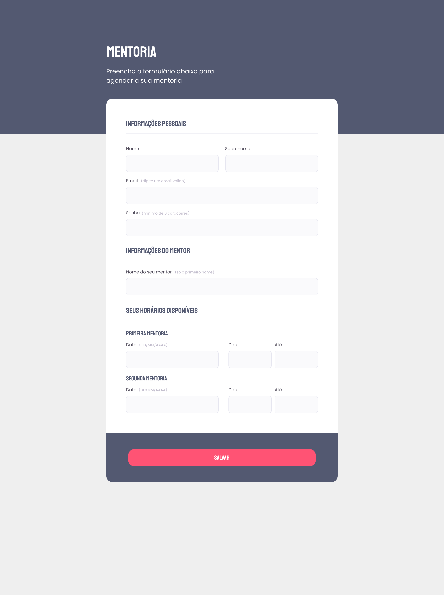
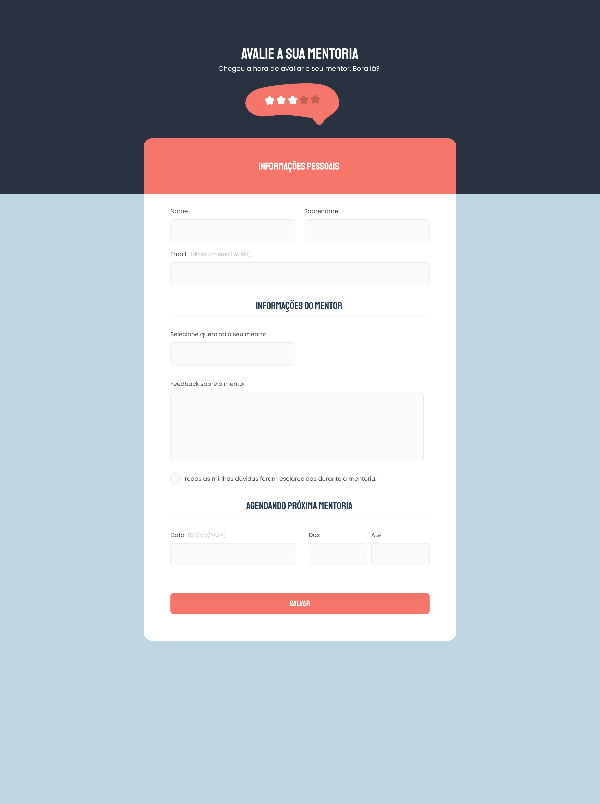

# 🚀 Criando formulários

## 🎯 Sobre o desafio

Nesse desafio foi proposto a fazer dois layouts, um que seria um desafio intermediario e outro que seria um desafio mais avançado.

- Layout intermediario - Pronto - Main Branch
- Layout Avançado - Em desenvolvimento.

#

## 📝 Stack utilizada

**Front-end:** HTML, CSS

#

## 🎨 Layouts

#

- [Figma Layout - Intermediario](<https://www.figma.com/file/gsRjaJVDY9Cv0fCmxnDzjZ/Stage-03---Formul%C3%A1rio-intermedi%C3%A1rio-(Copy)>)
- [Figma Layout - Avançado](<https://www.figma.com/file/Tz48jG7G8O656B4NwJNNNU/Stage-03---Formul%C3%A1rio-avan%C3%A7ado-(Copy)>)

#

## 🧑‍💻 Autores

- [@rocketseat](https://www.instagram.com/rocketseat/)

#

## 🤳 Screenshots

#

# Desafio Intermediario

#

# Desafio Avançado

